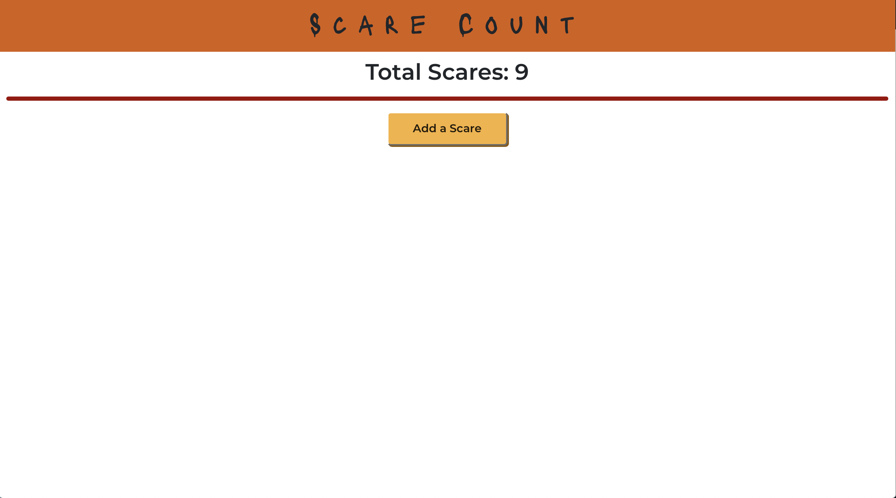

# Scare Count
A React App to track how many times The Haunting of Bly Manor scares you.
I made this app while watching the first episode of Netflix's The Haunting of Bly Manor. 

<!-- https://scare-count.herokuapp.com -->

## Screenshot

## Next Steps
* I've found a couple of different methods to persist state via the local machine so that I wouldn't need a login to keep track of the scares. 
* I would like to add an episode by episode count of scares, and maybe add a show by show count. The utility of this is... questionable